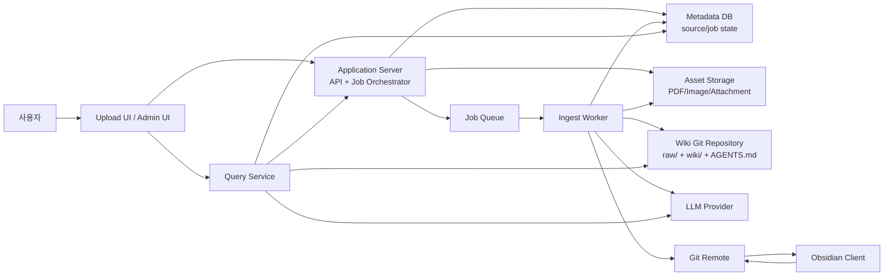
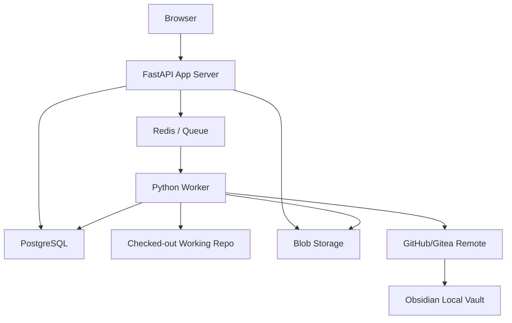
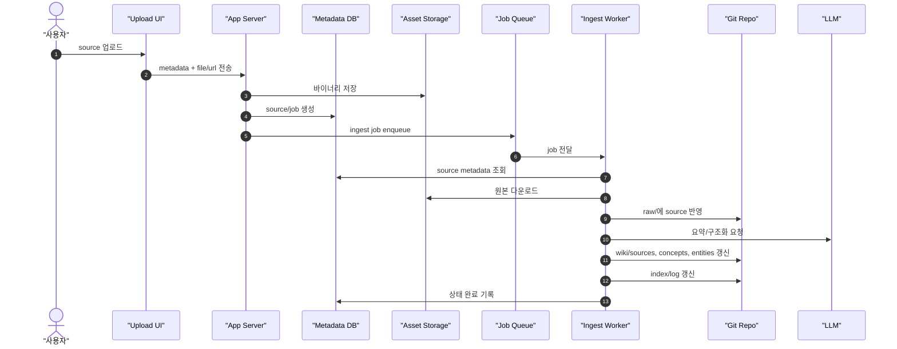
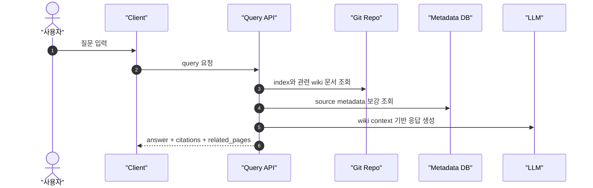

# Application Architecture

## 요약

이 아키텍처는 `Obsidian 문서 기반 LLM wiki`를 웹 애플리케이션으로 운영하기 위한 구조다. 핵심 원칙은 앱 서버가 지식의 최종 저장소가 아니라 `오케스트레이터` 역할을 하고, 최종 산출물은 계속 `raw/`와 `wiki/`의 파일 및 Git 히스토리로 남는다는 점이다.

## 상위 구조

## 책임 분리

### Upload UI

- 원천자료 종류별 업로드 진입점
- 최소 타입
  - URL/article
  - PDF
  - image
  - freeform text
  - meeting note
- 업로드 시 source type, title, tags, 원본 링크, 설명을 함께 받는다

### Application Server

- 업로드 요청 검증
- source/job 메타데이터 저장
- ingest 작업 생성
- query API 제공
- 작업 상태와 최근 변경 이력 노출

### Ingest Worker

- 새 source를 읽고 `raw/`와 `wiki/`에 반영
- source note 생성
- concept/entity/synthesis 문서 갱신
- `index.md`, `log.md` 갱신
- 변경분을 Git commit/push

### Query Service

- 기본적으로 `wiki/`를 우선 읽는다
- 필요한 경우에만 raw나 자산을 참조한다
- 응답은 answer뿐 아니라 citation, related pages를 함께 반환한다

### Git Repository

- 텍스트성 산출물의 source of truth
- `wiki/*.md`, 텍스트 raw, 규약 문서 저장
- Obsidian은 이 repo clone을 연다

### Asset Storage

- PDF, 이미지, 첨부파일 등 큰 바이너리 보관
- repo에는 가능하면 메타데이터와 참조 경로만 저장

## 추천 배포 구조

## 핵심 설계 원칙

1. single-writer 원칙
   - `wiki/`와 `raw/`의 자동 수정은 ingest worker만 수행한다.
   - 앱 서버와 query 경로는 working tree를 직접 수정하지 않는다.

2. Git-first 원칙
   - 최종 결과는 DB가 아니라 markdown 파일과 commit history다.
   - DB는 검색 보조와 job 상태 관리용이다.

3. query는 wiki 우선
   - query API는 `index -> relevant wiki pages -> answer` 순서를 따른다.
   - raw 직접 검색은 보조 경로여야 한다.

4. 바이너리 분리
   - PDF/이미지는 object storage 또는 별도 자산 디렉터리로 관리한다.
   - markdown에는 참조 링크와 추출 결과만 남긴다.

5. Obsidian 친화성 유지
   - wikilink, frontmatter, 디렉터리 규약을 깨지 않는다.
   - 사람과 LLM이 같은 파일을 읽고 수정할 수 있어야 한다.

## 업로드 후 ingest 흐름

## Query API 흐름

## API 경계 제안

- `POST /sources`
  - 새 원천자료 등록
- `GET /sources`
  - source 목록 및 상태 조회
- `GET /jobs/{id}`
  - ingest 작업 상태 조회
- `POST /query`
  - 위키 기반 질의
- `GET /wiki/pages`
  - 페이지 메타데이터 조회
- `POST /admin/lint`
  - lint 작업 실행

## 주의할 리스크

- Obsidian 사용자가 직접 편집하는 동안 worker가 같은 파일을 수정하면 충돌이 생길 수 있다.
- ingest 품질이 낮으면 wiki가 빠르게 노이즈로 오염된다.
- 모든 업로드를 Git에 바로 넣으면 바이너리와 커밋 노이즈가 커진다.
- query가 raw fallback에 과도하게 의존하면 위키 축적 가치가 약해진다.

## 현재 저장소에 대한 해석

현재 저장소는 아직 서버 애플리케이션은 없고, `Git repo + Obsidian vault + PowerShell 운영 도구 + AGENTS 규약`까지만 갖춘 상태다. 따라서 다음 단계는 이 문서를 기준으로 앱 서버와 worker를 실제 코드로 구현하는 것이다.

## 연결 문서

- [[overview]]
- [[concepts/llm-wiki-pattern]]
- [[syntheses/implementation-blueprint]]
- [[syntheses/process-diagrams]]
- [[log]]
