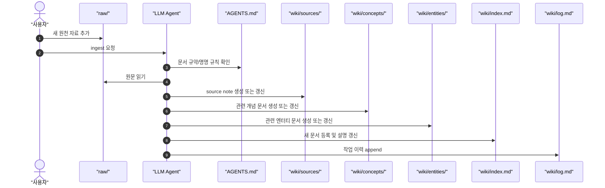
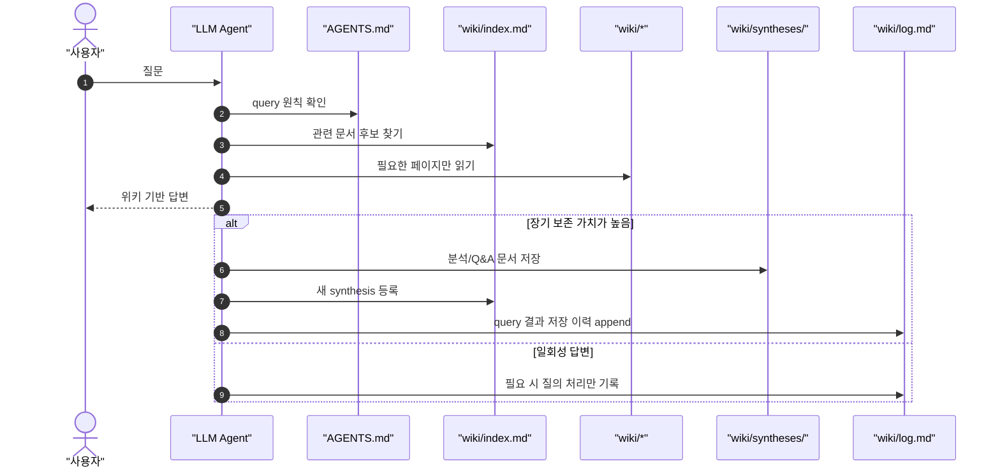
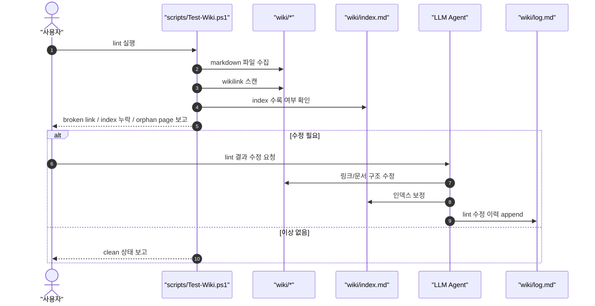

# Process Diagrams

## 요약

이 문서는 현재 저장소의 처리과정을 `ingest`, `query`, `lint` 세 루프로 나누어 시퀀스 다이어그램으로 정리한다. 개요도보다 더 중요한 점은, 각 단계에서 어떤 파일이 갱신되고 어떤 판단이 필요한지를 명확히 고정하는 것이다.

## Ingest Sequence

### Ingest 판단 기준

- 새 source note가 필요한가, 기존 source note를 확장하면 되는가
- 이번 자료가 새 concept/entity 문서를 만들 정도로 독립적인가
- 기존 주장과 충돌하는 내용이 있는가
- index에 어떤 설명으로 노출해야 재검색 비용이 줄어드는가

## Query Sequence

### Query 판단 기준

- raw를 다시 읽어야 하는지, 현재 wiki만으로 충분한지
- 답변이 일회성인지, 재사용 가치가 높은 synthesis인지
- 새 synthesis가 기존 문서를 대체하는지, 보완하는지

## Lint Sequence

### Lint 판단 기준

- 문서가 존재하지만 index에서 빠져 있는가
- 어느 페이지도 가리키지 않는 orphan 문서가 있는가
- 깨진 링크가 실제 오타인지, 아직 만들 페이지인지
- 구조상 concept/entity/source/synthesis 배치가 적절한가

## 전체 운영 의미

- ingest는 `새 지식을 위키에 편입`하는 단계다.
- query는 `축적된 위키를 사용`하는 단계다.
- lint는 `위키를 계속 읽기 좋은 상태로 유지`하는 단계다.

세 루프가 모두 돌아야 이 프로젝트는 단순 노트 저장소가 아니라 `LLM이 유지하는 지식 시스템`이 된다.

## 연결 문서

- [[overview]]
- [[concepts/llm-wiki-pattern]]
- [[syntheses/implementation-blueprint]]
- [[log]]
